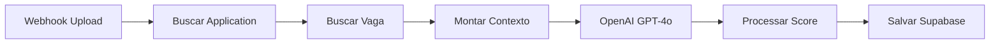
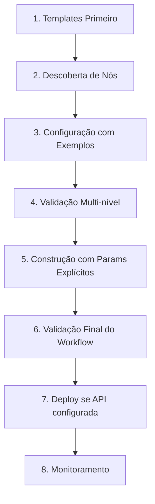

# Antigravity - Guia de Desenvolvimento de Workflows n8n

> Documentação de suporte para criação de fluxos de trabalho de automação no n8n para o projeto ATS Inteligente

## 📋 Visão Geral

Este documento serve como guia de referência para o Antigravity AI Assistant no desenvolvimento de workflows no n8n. Ele cobre **ferramentas disponíveis**, **padrões obrigatórios**, **workflows existentes** e **lições aprendidas** no projeto de Análise Inteligente de Currículos (ATS).

---

## 🎯 Objetivo do Projeto

Sistema ATS inteligente e responsável que:
- **Automatiza** a triagem de candidatos em alto volume
- **Utiliza IA** (GPT-4o) para extração semântica e scoring ponderado
- **Garante auditabilidade** com logs transparentes e rastreáveis
- **Mantém foco humano** com decisões explicáveis e configuráveis por vaga

---

## 🛠️ Ferramentas e Integrações

### Servidor MCP do n8n ✅ ATIVO
| Atributo | Valor |
|---|---|
| **Repositório** | [czlonkowski/n8n-mcp](https://github.com/czlonkowski/n8n-mcp) |
| **Status** | ✅ Instalado globalmente via npm |
| **Config** | `C:\Users\jarde\.gemini\antigravity\mcp_config.json` |
| **n8n URL** | `https://n8n.lynxa.cloud` |

**7 Ferramentas Core** (sempre disponíveis):

| Ferramenta | Uso | Performance |
|---|---|---|
| `tools_documentation` | Docs de ferramentas MCP | Instant |
| `search_nodes` | Busca full-text em 1.084 nós | Instant |
| `get_node` | Info detalhada (minimal/standard/full/docs) | Instant–Moderado |
| `validate_node` | Validação de config (minimal/full) | Fast |
| `validate_workflow` | Validação completa de workflow | Moderado |
| `search_templates` | Busca em 2.709 templates | Fast |
| `get_template` | JSON completo de template | Fast |

**13 Ferramentas de Gerenciamento** (requer `N8N_API_KEY`):
- Workflows: `create`, `get`, `update_full`, `update_partial`, `delete`, `list`, `validate`, `autofix`, `versions`, `deploy_template`
- Execuções: `test_workflow`, `n8n_executions`
- Sistema: `n8n_health_check`

### Skills do n8n ✅ DISPONÍVEIS

Localização: `resources/n8n-skills-main/skills/`

| # | Skill | Prioridade | Arquivo |
|---|---|---|---|
| 1 | **n8n MCP Tools Expert** | ⭐ MÁXIMA | `n8n-mcp-tools-expert/SKILL.md` |
| 2 | **n8n Workflow Patterns** | Alta | `n8n-workflow-patterns/SKILL.md` |
| 3 | **n8n Expression Syntax** | Alta | `n8n-expression-syntax/SKILL.md` |
| 4 | **n8n Validation Expert** | Alta | `n8n-validation-expert/SKILL.md` |
| 5 | **n8n Node Configuration** | Média | `n8n-node-configuration/SKILL.md` |
| 6 | **n8n Code JavaScript** | Média | `n8n-code-javascript/SKILL.md` |
| 7 | **n8n Code Python** | Baixa | `n8n-code-python/SKILL.md` |

> [!TIP]
> Antes de criar qualquer workflow, leia a skill **n8n MCP Tools Expert** para entender o fluxo correto de uso das ferramentas.

### Integrações Ativas

- **Supabase** — PostgreSQL (tabelas: `job_applications`, `jobs`, `candidates`)
- **Next.js API** — Frontend em `frontend/` (rota: `/api/candidates/submit`)
- **OpenAI GPT-4o** — Análise semântica via HTTP Request
- **n8n Self-hosted** — `https://n8n.lynxa.cloud`

---

## 🏗️ Workflows Existentes

### Workflow de Produção: `ATS_Workflow_Upload_PRODUCTION.json`

**Nome**: `ATS - Upload & Análise (PRODUCTION v3)`
**Webhook**: `POST /webhook/ats-upload`
**Versão**: `production-v3`



| Nó | Tipo | Responsabilidade |
|---|---|---|
| **Webhook Upload** | `webhook` | Recebe POST com `applicationId`, `resume_text`, `candidate_name` |
| **Buscar Application** | `supabase` (getAll) | Busca dados da candidatura pelo ID |
| **Buscar Vaga** | `supabase` (getAll) | Busca requisitos da vaga (`jobs.required_skills`, `analysis_config`) |
| **Montar Contexto** | `code` | Monta prompt com pesos configuráveis e critérios da vaga |
| **OpenAI GPT-4o** | `httpRequest` | Análise com GPT-4o (temperature 0.15, JSON mode) |
| **Processar Score** | `code` | Calcula score ponderado, classifica status/prioridade |
| **Salvar Supabase** | `supabase` (update) | Atualiza `job_applications` com resultado |

### Workflow Simples: `n8n-workflow-SIMPLES.json`

**Nome**: `ATS - Processamento de Candidatos (SIMPLES)`
**Webhook**: `POST /webhook/ats-processing`
Versão simplificada com error handling e response direto.

### Outros Workflows

| Arquivo | Função |
|---|---|
| `ATS_Workflow_Batch.json` | Processamento em lote |
| `ATS_Workflow_Email.json` | Ingestão via email |
| `n8n-ats-workflow-complete.json` | Versão completa com multi-agent |
| `n8n-error-handler-workflow.json` | Handler de erros global |
| `n8n-intelligent-screening.json` | Triagem inteligente avançada |

---

## 📐 Padrões Obrigatórios

### 1. Score Ponderado Configurável

A análise utiliza **pesos configuráveis por vaga** via `jobs.analysis_config`:

```javascript
// Pesos padrão (total = 100%)
const weights = {
  job_fit: 35,      // Aderência à vaga
  experience: 25,   // Experiência profissional
  education: 20,    // Formação e certificações
  communication: 20 // Comunicação e soft skills
};

// Cálculo
score = job_fit * 0.35 + experience * 0.25 + education * 0.20 + communication * 0.20;
```

### 2. Classificação de Candidatos

| Score | Status | Prioridade |
|---|---|---|
| ≥ 90 | `QUALIFIED` | `URGENT` |
| 75–89 | `QUALIFIED` | `HIGH` |
| 50–74 | `REVIEW` | `MEDIUM` |
| < 50 | `REJECTED` | `LOW` |

### 3. Estrutura de Output da IA

```json
{
  "candidate_name": "string",
  "candidate_email": "string|null",
  "phone": "string|null",
  "skills": ["skill1"],
  "years_experience": 0,
  "seniority_level": "JUNIOR|PLENO|SENIOR|SPECIALIST|LEAD",
  "score_breakdown": { "job_fit": 0, "experience": 0, "education": 0, "communication": 0 },
  "final_score": 0,
  "matching_rationale": "análise detalhada",
  "strengths": [], "weaknesses": [], "red_flags": [],
  "matched_skills": [], "missing_skills": [],
  "summary": "resumo executivo 2 linhas"
}
```

### 4. Tratamento de Erros

```javascript
try {
  ai = JSON.parse(content);
} catch (e) {
  return {
    json: {
      success: false,
      ai_score: 0,
      status: 'REJECTED',
      matching_rationale: 'Erro na análise: ' + e.message,
      ai_status: 'ERROR'
    }
  };
}
```

### 5. Credenciais e Segurança
- Supabase: credencial `supabase-credentials`
- OpenAI: credencial `openAiApi`
- Webhooks: Path segue padrão `ats-*`
- **Nunca** hardcodar secrets nos workflows

---

## ⚠️ Lições Aprendidas & Erros Comuns

> [!CAUTION]
> Estas são falhas reais encontradas durante o desenvolvimento. Consulte antes de criar workflows.

### 1. Supabase `get` vs `getAll`

**Problema**: Nó Supabase com `operation: "get"` requer condição de seleção definida na UI.
**Erro**: *"At least one select condition must be defined"*
**Solução**: Usar `operation: "getAll"` com `filters.conditions` e `limit: 1`.

```json
{
  "operation": "getAll",
  "tableId": "job_applications",
  "limit": 1,
  "filters": {
    "conditions": [{ "key": "id", "value": "={{ $json.body.applicationId }}", "operator": "eq" }]
  }
}
```

### 2. Colunas Inexistentes no Schema

**Problema**: Tentar gravar em coluna que não existe (ex: `matching_rationale` vs `notes`).
**Erro**: *"Could not find the 'X' column in the schema cache"*
**Solução**: Sempre verificar schema real do Supabase antes de mapear campos.

### 3. Supabase Update — `filterType: "string"`

**Padrão correto** para updates por ID:
```json
{
  "operation": "update",
  "filterType": "string",
  "filterString": "={{ 'id=eq.' + $json.applicationId }}"
}
```

### 4. Valores Padrão Perigosos

**Nunca** confie em defaults de parâmetros — configure **todos** explicitamente. Exemplo:
```json
// ❌ Falta channel, vai falhar
{ "resource": "message", "operation": "post", "text": "Hello" }

// ✅ Todos parâmetros explícitos
{ "resource": "message", "operation": "post", "select": "channel", "channelId": "C123", "text": "Hello" }
```

### 5. Conexões IF com Branches

Nós IF têm **duas saídas** — use `branch: "true"` / `branch: "false"` explicitamente.

---

## 🔄 Processo de Criação de Workflow

### Fluxo de 8 Etapas



**Resumo rápido**:
1. `search_templates()` — Buscar templates antes de criar do zero
2. `search_nodes({includeExamples: true})` — Descobrir nós necessários
3. `get_node({detail: 'standard'})` — Configurar com propriedades essenciais
4. `validate_node({mode: 'minimal'})` → `validate_node({mode: 'full'})` — Validar
5. Construir JSON com **todos** os parâmetros explícitos
6. `validate_workflow(workflow)` — Validar conexões e expressões
7. `n8n_create_workflow()` — Implantar (requer API key)
8. `n8n_executions({action: 'list'})` — Monitorar

### Checklist de Novo Workflow

- [ ] Objetivo claro definido
- [ ] Consultar templates existentes
- [ ] Mapear entradas e saídas
- [ ] Configurar trigger (webhook, cron, email)
- [ ] Implementar error handling
- [ ] Validar cada nó (`minimal` → `full`)
- [ ] Validar workflow completo
- [ ] Testar com dados reais
- [ ] Adicionar tags (`ats`, `production`)
- [ ] Documentar no Antigravity.md

---

## 📝 Convenções

### Nomes de Workflows
`[ÁREA] - [FUNÇÃO]` — Ex: `ATS - Upload & Análise (PRODUCTION v3)`

### Nomes de Nós
- IDs: kebab-case (`prepare-ai-prompt`)
- Names: Português, descritivos (`Montar Contexto`, `Processar Score`)

### Credenciais
`[serviço]-credentials` ou `[serviço]-[ambiente]` — Ex: `supabase-credentials`, `openai-production`

---

## 🧪 Testes

### Via cURL
```bash
curl -X POST https://n8n.lynxa.cloud/webhook/ats-upload \
  -H "Content-Type: application/json" \
  -d '{"applicationId":"uuid","candidate_name":"Test","resume_text":"...","source":"manual"}'
```

### Verificação
1. Confirmar inserção/atualização em `job_applications` no Supabase
2. Revisar `ai_score`, `ai_status`, `priority` nos dados retornados
3. Testar edge cases: texto vazio, JSON inválido, candidato sem skills

---

## 🔗 Referências

| Recurso | URL/Path |
|---|---|
| n8n Instance | `https://n8n.lynxa.cloud` |
| n8n Docs | [docs.n8n.io](https://docs.n8n.io) |
| n8n MCP Server | [github.com/czlonkowski/n8n-mcp](https://github.com/czlonkowski/n8n-mcp) |
| n8n Skills | [github.com/czlonkowski/n8n-skills](https://github.com/czlonkowski/n8n-skills) |
| Skills (local) | `resources/n8n-skills-main/skills/` |
| AGENTS.md | `docs/AGENTS.md` |
| Workflows | `backend/workflows/` |
| MCP Config | `C:\Users\jarde\.gemini\antigravity\mcp_config.json` |

---

**Última Atualização**: 2026-02-12T22:03:00-03:00
**Versão**: 3.0.0 (Atualizado com workflows de produção e lições aprendidas)
**Mantido por**: Antigravity AI Assistant
