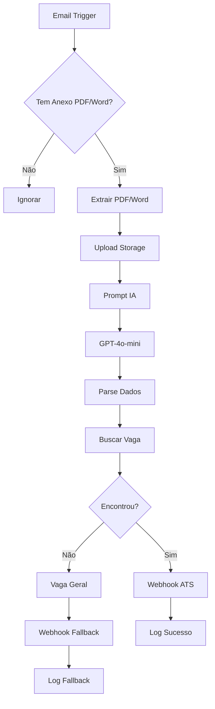

# Workflow de Ingestão Inteligente por Email

## 🎯 Visão Geral

Workflow **totalmente automático** que monitora emails, extrai currículos e processa candidatos **sem precisar de formato específico**.

**Arquivo**: `n8n-email-ingestion-workflow.json`

## 🌟 Diferencial: IA Extrai Tudo Automaticamente

- ✅ **Sem regras rígidas** de assunto ou corpo
- ✅ **IA identifica** nome, vaga pretendida, empresa
- ✅ **Suporte a PDF e Word (.doc, .docx)**
- ✅ **Fallback inteligente** se vaga não for encontrada
- ✅ **Upload automático** no Supabase Storage
- ✅ **Integra** com workflow principal via webhook

---

## 🏗️ Arquitetura (18 nós)



### Fluxo Detalhado

1. **Email Trigger** - Busca emails não lidos a cada minuto
2. **Validar Anexo** - Verifica se tem anexo PDF ou Word
3. **Extrair Currículo** - Filtra PDFs e arquivos Word (.doc, .docx)
4. **Upload Storage** - Supabase bucket `resumes/2026-02-12/email_file.ext`
5. **Preparar IA** - Monta prompt com corpo do email
6. **IA Extrai Dados** - GPT-4o-mini identifica nome, vaga, empresa
7. **Processar** - Parse + validação + fallbacks
8. **Buscar Vaga** - Query no Supabase pelo título
9. **Se Encontrou** → Webhook com job_id correto
10. **Se Não** → Webhook com job_id genérico ("Vaga Geral")

---

## 🤖 Como a IA Funciona

### Prompt para Extração

```
Você é um assistente de RH especializado em extrair informações de emails de candidatura.

EMAIL:
De: joao@email.com
Assunto: Quero trabalhar aí!
Conteúdo:
Olá! Meu nome é João Silva e gostaria de me candidatar 
para a vaga de desenvolvedor full stack...

TAREFA:
Extraia as seguintes informações...

Retorne JSON:
{
  "candidate_name": "João Silva",
  "job_title": "Desenvolvedor Full Stack",
  "company_mentioned": null,
  "message_summary": "Candidatura espontânea",
  "confidence_score": 85,
  "extraction_notes": "Nome e cargo claramente identificados"
}
```

### Exemplos de Extração

#### Email 1: Estruturado
```
De: maria@email.com
Assunto: Candidatura - Engenheiro de Dados

Nome completo: Maria Silva
Vaga pretendida: Engenheiro de Dados
```

**IA extrai:**
```json
{
  "candidate_name": "Maria Silva",
  "job_title": "Engenheiro de Dados",
  "confidence_score": 95
}
```

#### Email 2: Livre (sem padrão)
```
De: pedro@email.com
Assunto: (vazio)

Oi, me chamo Pedro e quero trabalhar como DevOps na empresa.
```

**IA extrai:**
```json
{
  "candidate_name": "Pedro",
  "job_title": "DevOps",
  "confidence_score": 75
}
```

#### Email 3: Muito vago
```
De: jose@email.com
Assunto: Currículo

Segue meu currículo.
```

**IA extrai com fallback:**
```json
{
  "candidate_name": "jose",  // do email
  "job_title": "Vaga Geral",
  "confidence_score": 30
}
```

---

## ⚙️ Configuração

### 1. Executar SQL no Supabase

```bash
# 1. Abra Supabase → SQL Editor
# 2. Execute: supabase-storage-setup.sql
# 3. Verifique se bucket 'resumes' foi criado
```

Isso cria:
- ✅ Bucket `resumes` (público, PDFs e Word, 10MB max)
- ✅ Políticas RLS
- ✅ Vaga genérica (fallback)
- ✅ View de resumo

### 2. Configurar Email no n8n

**Opção A: Gmail**

1. Habilite IMAP: Gmail → Settings → Forwarding and POP/IMAP
2. Crie App Password: Google Account → Security → 2-Step → App Passwords
3. No n8n:
   - Host: `imap.gmail.com`
   - Port: `993`
   - User: `seu-email@gmail.com`
   - Password: `app-password-gerado`
   - Secure: `SSL/TLS`

**Opção B: Outlook**

1. Habilite IMAP: Outlook.com → Settings → Mail → Sync email
2. No n8n:
   - Host: `outlook.office365.com`
   - Port: `993`
   - User: `seu-email@outlook.com`
   - Password: `sua-senha`
   - Secure: `SSL/TLS`

### 3. Importar Workflow

1. n8n → Workflows → Import from File
2. Selecione `n8n-email-ingestion-workflow.json`
3. Import

### 4. Conectar Sub-nodes da IA

**CRÍTICO**: Conecte manualmente:
- `OpenAI Extraction` → `IA - Extrair Dados` (ai_languageModel)
- `Output Parser` → `IA - Extrair Dados` (ai_outputParser)

### 5. Configurar Credenciais

- **Email IMAP**: Sua credencial de email
- **Supabase**: Service role key
- **OpenAI**: Sua API key existente

### 6. Ativar Workflow

Toggle "Active" → Workflow monitora emails a cada minuto

---

## 📧 Funcionamento na Prática

### Cenário 1: Email Bem Formatado ✅

```
De: candidato@email.com
Assunto: Candidatura - Desenvolvedor Full Stack
Anexo: curriculo.pdf

Nome: João Silva
Vaga: Desenvolvedor Full Stack
```

**Resultado:**
- PDF salvo: `resumes/2026-02-12/candidato@email.com_curriculo.pdf`
- IA extrai: nome="João Silva", vaga="Desenvolvedor Full Stack"
- Busca vaga no DB → encontra job_id
- Envia webhook com dados completos
- Score IA: 75 (exemplo)
- Status: QUALIFIED

### Cenário 2: Email Livre (Realista) ✅

```
De: maria@empresa.com
Assunto: (vazio)
Anexo: Maria_CV_2026.pdf

Olá! Gostaria de fazer parte da equipe como engenheira de dados.
Segue meu currículo.
```

**Resultado:**
- PDF salvo: `resumes/2026-02-12/maria@empresa.com_Maria_CV_2026.pdf`
- IA extrai: nome="Maria", vaga="Engenheira de Dados"
- Busca vaga "Engenheira de Dados" → encontra
- Processa normalmente

### Cenário 3: Email Muito Vago ⚠️

```
De: pedro@test.com
Assunto: Currículo
Anexo: curriculo.pdf

Segue.
```

**Resultado:**
- PDF salvo normalmente
- IA extrai: nome="pedro" (do email), vaga="Vaga Geral"
- Busca "Vaga Geral" → job_id genérico
- Envia webhook com fallback
- Sistema processa mas marca para **revisão manual**

---

## 🔍 Monitoramento

### Ver Execuções

1. n8n → Executions
2. Filtrar por "ATS - Ingestão Inteligente por Email"
3. Verificar:
   - ✅ `processed` - Email processado com sucesso
   - ⚠️ `processed_with_fallback` - Vaga não encontrada
   - ⏭️ `skipped` - Sem anexo PDF

### Ver Uploads no Supabase

```sql
-- Ver últimos 10 currículos
SELECT * FROM resume_files_summary
ORDER BY uploaded_at DESC
LIMIT 10;

-- Ver por data
SELECT 
  file_name,
  public_url,
  uploaded_at,
  file_size
FROM resume_files_summary
WHERE uploaded_at::date = '2026-02-12'::date;
```

### Verificar Candidatos Processados

```sql
-- Candidatos de hoje vindos do email
SELECT 
  c.name,
  c.email,
  c.status,
  c.resume_url,
  c.created_at
FROM candidates c
WHERE c.created_at::date = CURRENT_DATE
  AND c.resume_url LIKE '%/storage/v1/object/public/resumes/%'
ORDER BY c.created_at DESC;
```

---

## ⚙️ Configurações Avançadas

### Ajustar Frequência de Verificação

No nó "Email Trigger - Não Lidos":
```json
{
  "pollTimes": {
    "item": [
      {
        "mode": "everyMinute"  // Opções: everyMinute, everyHour, custom
      }
    ]
  }
}
```

**Recomendações**:
- **Alta demanda**: `everyMinute`
- **Média demanda**: `every5Minutes` (adicione custom: `*/5 * * * *`)
- **Baixa demanda**: `everyHour`

### Filtrar Por Pasta/Label

```json
{
  "mailbox": "Candidatos"  // Trocar de INBOX para pasta específica
}
```

### Adicionar Filtro de Data

No Code Node "Extrair PDF", adicionar:
```javascript
// Ignorar emails mais antigos que 7 dias
const emailDate = new Date($json.date);
const daysDiff = (Date.now() - emailDate) / (1000 * 60 * 60 * 24);

if (daysDiff > 7) {
  return [];  // Ignora
}
```

---

## ⚠️ Limitações e Soluções

### Limitação 1: Nomes de Arquivo Duplicados

**Problema**: Dois candidatos com mesmo email e mesmo nome de arquivo.

**Solução Atual**: Sobrescreve (último vence).

**Solução Melhor**: Adicionar UUID ou timestamp:
```javascript
const uniqueFilename = `${Date.now()}_${$json.attachment_filename}`;
```

### Limitação 2: IA Confunde Vaga

**Problema**: IA extrai vaga errada de email ambíguo.

**Solução**: Ajustar confidence_score threshold:
```javascript
if (extractedData.confidence_score < 60) {
  extractedData.job_title = 'Vaga Geral';  // Force fallback
}
```

### Limitação 3: Múltiplos Anexos

**Problema**: Email com vários PDFs (currículo + portfólio).

**Solução Atual**: Pega apenas o primeiro PDF.

**Solução Melhor**: Loop para processar todos PDFs ou filtrar por nome ("curriculo", "cv", "resume").

---

## 🎯 Próximos Passos

### Após Importar

1. [ ] Executar `supabase-storage-setup.sql`
2. [ ] Configurar credencial IMAP no n8n
3. [ ] Conectar sub-nodes do agente IA
4. [ ] Ativar workflow
5. [ ] Enviar email de teste

### Melhorias Futuras

- [ ] Extrair texto do PDF e incluir no prompt da IA
- [ ] Notificar RH quando vaga não for encontrada
- [ ] Dashboard de emails processados
- [ ] Auto-reply agradecendo candidato
- [ ] Análise de sentimento do email

---

## 📊 Custos Estimados

### Por Candidato (Email)

- **Upload Supabase Storage**: Grátis (até 1GB)
- **IA Extração (GPT-4o-mini)**: ~300 tokens = $0.00018
- **Análise Principal (GPT-4o-mini)**: ~900 tokens = $0.00054
- **Total**: ~$0.00072 por candidato

### Para 1000 Candidatos/Mês

- **Total**: ~$0.72
- **Armazenamento**: ~500MB (média 500KB/PDF) = Grátis
- **Network**: Grátis (dentro dos limites Supabase)

**Conclusão**: Extremamente econômico! 💰

---

**Versão**: 1.0  
**Data**: 2026-02-12  
**Workflow Independente**: Pode ativar/desativar sem afetar webhook principal  
**Modelo IA**: GPT-4o-mini @ temperature 0.2
