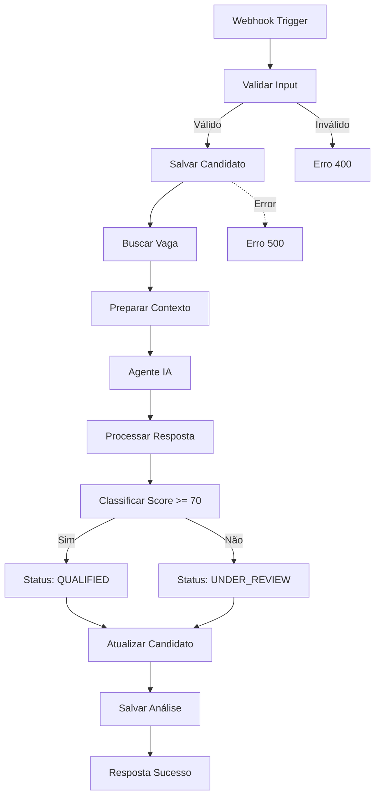

# Workflow ATS Completo - Guia de Configuração

## 📋 Visão Geral

Workflow n8n completo para análise inteligente de candidatos usando IA GPT-4o-mini.

**Arquivo**: `n8n-ats-workflow-complete.json`

## 🏗️ Arquitetura

### Fluxo Principal (18 nós)



## 🎯 Funcionalidades

### ✅ Implementado

1. **Validação de Input**
   - Nome obrigatório
   - Email com regex de validação
   - URL do currículo obrigatória
   - ID da vaga obrigatório

2. **Integração Supabase**
   - Insert em `candidates`
   - Query em `jobs` para obter requisitos
   - Update de status do candidato
   - Insert em `screening_matrix`

3. **Agente IA Configurado**
   - Modelo: GPT-4o-mini
   - Temperature: 0.3 (determinístico)
   - Max Tokens: 1500
   - Structured Output Parser (JSON garantido)
   - Buffer Memory por candidato

4. **Processamento Inteligente**
   - Parse robusto com fallback
   - Validação de campos obrigatórios
   - Normalização de score (0-100)
   - Garantia de arrays válidos
   - Timestamp de processamento

5. **Classificação Automática**
   - Score >= 70: `QUALIFIED`
   - Score < 70: `UNDER_REVIEW`

6. **Tratamento de Erros**
   - Input inválido → 400
   - Erro Supabase → 500
   - Erro IA → Fallback com score 0
   - Sempre responde ao webhook

7. **Auditabilidade**
   - Timestamp de análise
   - Modelo usado (gpt-4o-mini)
   - Versão do prompt (2.0)
   - Log de erros quando aplicável

## 🗄️ Estrutura do Supabase Necessária

### Tabela: `jobs`

```sql
CREATE TABLE jobs (
  id UUID PRIMARY KEY DEFAULT gen_random_uuid(),
  title TEXT NOT NULL,
  description TEXT,
  required_skills JSONB DEFAULT '[]'::jsonb,
  company_id UUID,
  created_at TIMESTAMPTZ DEFAULT NOW(),
  updated_at TIMESTAMPTZ DEFAULT NOW()
);

-- Exemplo de insert
INSERT INTO jobs (title, description, required_skills) VALUES 
(
  'Desenvolvedor Full Stack',
  'Buscamos desenvolvedor com experiência em React, Node.js e PostgreSQL para projeto inovador.',
  '["React", "Node.js", "PostgreSQL", "TypeScript", "Git"]'::jsonb
);
```

### Tabela: `candidates` (já existe, adicionar campo)

```sql
-- Verificar se status existe
ALTER TABLE candidates 
ADD COLUMN IF NOT EXISTS status TEXT DEFAULT 'NEW';

-- Valores possíveis: NEW, QUALIFIED, UNDER_REVIEW, REJECTED, HIRED
```

### Tabela: `screening_matrix` (já existe, verificar campos)

```sql
-- Deve ter pelo menos estes campos:
-- candidate_id UUID
-- job_id UUID  
-- company_id UUID
-- semantic_match_score INTEGER
-- skills_gap JSONB
-- ai_reasoning TEXT
-- auditable_decision_log JSONB
```

## 🔧 Configuração no n8n

### 1. Importar Workflow

1. Acesse https://n8n.lynxa.cloud
2. Clique em "Import from File"
3. Selecione `n8n-ats-workflow-complete.json`
4. Clique em "Import"

### 2. Configurar Credenciais

#### OpenAI (já configurada)
- Nome da credencial: `OpenAI ATS` ou sua credencial existente
- Modelo: gpt-4o-mini (já configurado no workflow)
- ✅ Sem alterações necessárias se já está funcionando

#### Supabase (já configurada)
- Nome da credencial: `Supabase ATS`
- ✅ Sem alterações necessárias

### 3. Conectar Sub-nodes do Agente IA

**IMPORTANTE**: Os sub-nodes do agente LangChain precisam ser conectados manualmente:

1. Abra o workflow importado
2. Encontre o nó "Agente IA - Análise"
3. Arraste conexões:
   - `OpenAI GPT-4o-mini` → `Agente IA - Análise` (porta ai_languageModel)
   - `Memory` → `Agente IA - Análise` (porta ai_memory)
   - `Structured Output Parser` → `Agente IA - Análise` (porta ai_outputParser)

### 4. Ativar Workflow

1. Clique no toggle "Active" no canto superior direito
2. O webhook estará disponível em:
   ```
   https://n8n.lynxa.cloud/webhook/ats-core-ingestion
   ```

## 📝 Exemplo de Uso

### Request (POST)

```bash
curl -X POST https://n8n.lynxa.cloud/webhook/ats-core-ingestion \
  -H "Content-Type: application/json" \
  -d '{
    "name": "Maria Silva",
    "email": "maria@example.com",
    "resume_url": "https://example.com/curriculos/maria-silva.pdf",
    "job_id": "uuid-da-vaga-aqui",
    "company_id": "uuid-da-empresa-aqui"
  }'
```

### Response Sucesso (200)

```json
{
  "success": true,
  "candidate_id": "candidate-uuid",
  "status": "QUALIFIED",
  "score": 85,
  "recommendation": "APPROVED",
  "matched_skills": ["React", "Node.js", "PostgreSQL"],
  "skills_gap": ["Docker", "Kubernetes"],
  "message": "Candidato qualificado para próxima etapa!"
}
```

### Response Erro - Input Inválido (400)

```json
{
  "success": false,
  "error": "Dados inválidos",
  "message": "Verifique: name, email válido, resume_url e job_id são obrigatórios"
}
```

### Response Erro - Processamento (500)

```json
{
  "success": false,
  "error": "Erro interno no processamento",
  "message": "Falha ao processar candidato. Tente novamente.",
  "details": "Detalhes do erro"
}
```

## 🔍 Output da IA

A IA retorna um JSON estruturado com:

```typescript
{
  semantic_match_score: number;        // 0-100
  skills_gap: string[];                // Habilidades faltantes
  matched_skills: string[];            // Habilidades encontradas
  years_of_experience: number;         // Anos estimados
  ai_reasoning: string;                // Explicação >= 50 chars
  strengths: string[];                 // Pontos fortes
  weaknesses: string[];                // Pontos fracos
  recommendation: "APPROVED"|"INTERVIEW"|"REJECTED";
  auditable_decision_log: {
    analysis_date: string;
    model_used: "gpt-4o-mini";
    prompt_version: "2.0";
    processed_at: string;
  }
}
```

## ⚠️ Limitações Conhecidas

### 1. **Currículo não é processado** 🚧

**Status**: O workflow atual NÃO faz download nem extração de texto do PDF.

**Por quê**: Complexidade adicional (PDFs podem ser imagens, precisar OCR, etc.)

**Workaround Atual**: A IA faz uma avaliação baseada nas informações da vaga e nome do candidato.

**Solução Futura**: Adicionar nós:
- HTTP Request para download
- Code node com `pdf-parse` ou API OCR
- Incluir texto no prompt

### 2. **Credenciais hardcoded** ⚙️

**Status**: Workflow assume credenciais com nomes específicos:
- `OpenAI ATS` 
- `Supabase ATS`

**Solução**: Renomeie suas credenciais ou edite o workflow após importar.

### 3. **company_id opcional**

**Status**: Usa UUID zerado como fallback se não fornecido.

**Solução**: Torne obrigatório na validação se necessário.

## 🎯 Próximas Melhorias

### Prioridade Alta
- [ ] Implementar extração de texto do PDF
- [ ] Adicionar retry logic para chamadas IA
- [ ] Implementar rate limiting

### Prioridade Média
- [ ] Notificações (email/Slack) para candidatos qualificados
- [ ] Dashboard de métricas
- [ ] Processamento em lote (cron job)

### Prioridade Baixa
- [ ] Suporte multi-idioma
- [ ] Integração com calendário para agendamento
- [ ] Análise de viés na IA

## 📊 Monitoramento

### Verificar Execuções

1. Acesse n8n → Executions
2. Filtre por workflow "ATS - Análise Inteligente de Currículo v2"
3. Verifique erros:
   - Input inválido (esperado)
   - Erro Supabase (investigar conexão/schema)
   - Erro IA (verificar créditos OpenAI)

### KPIs para Acompanhar

- Taxa de sucesso (execuções bem-sucedidas / total)
- Score médio dos candidatos
- Tempo médio de processamento
- Taxa de classificação (QUALIFIED vs UNDER_REVIEW)
- Custo por análise (tokens OpenAI)

## 🆘 Troubleshooting

### Erro: "Credencial não encontrada"
**Solução**: Verifique se as credenciais `OpenAI ATS` e `Supabase ATS` existem.

### Erro: "Tabela jobs não encontrada"
**Solução**: Execute o SQL de criação da tabela `jobs` no Supabase.

### IA retorna texto em vez de JSON
**Solução**: O Structured Output Parser deve garantir JSON. Se falhar, o Code node faz fallback.

### Score sempre 0
**Solução**: Verifique logs da IA. Pode ser erro no parsing ou resposta inválida.

### Webhook não responde
**Solução**: 
1. Verifique se workflow está ativo
2. Confira URL do webhook
3. Verifique logs de execução

---

**Versão do Workflow**: 2.0  
**Data**: 2026-02-12  
**Modelo IA**: GPT-4o-mini  
**Última Atualização**: Este guia
